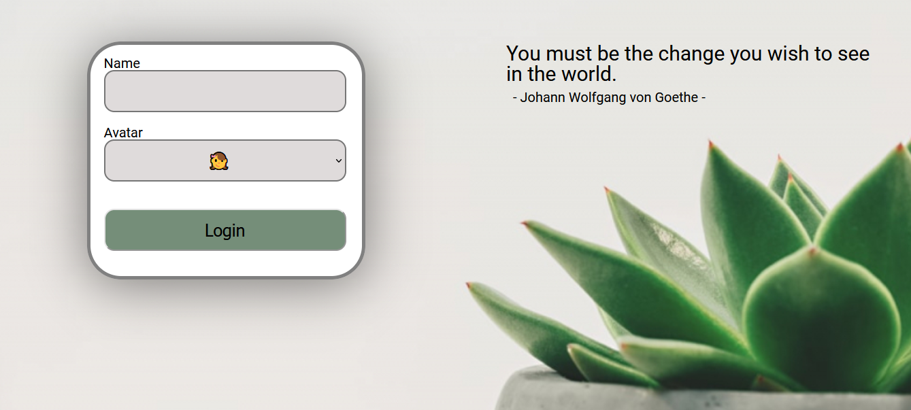
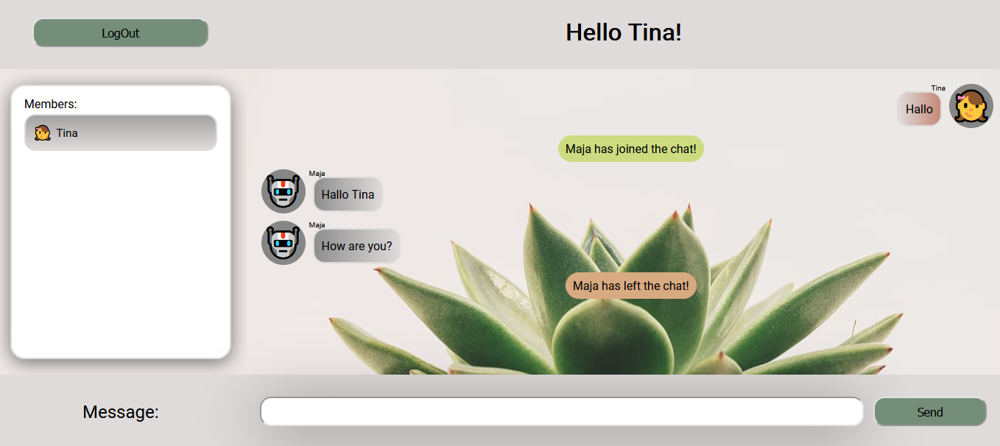

# Chat App

This Chat App is a ReactJS project that I started as a final certification exam for a Front-End developer.

## Technologies

Project is created with:

- React JS 17.0.2
- Scaledrone

## Connect to Scaledrone

You can create your Scaledrone channel for free using this [link](https://www.scaledrone.com).\
To connect to the channel you need to paste your channel ID in MyChatApp.jsx component,
or with .env file with environment variable _REACT_APP_SCALEDRONE_CHANNEL_ID_

```javascript
/* Scaledrone channel ID goes here */
const CHANNEL_ID =
  `${process.env.REACT_APP_SCALEDRONE_CHANNEL_ID}` || "{CHANNEL_ID_GOES_HERE}";
```

## Installation

Install it locally using npm:

```
$ nmp install
$ npm start
```

## Features

- Select your avatar
- Send and receive messages to all users
- Member list with all users
- Inform when new member joins the room
- Inform when member leaves the room

## Images

<p align="center">


</p>
